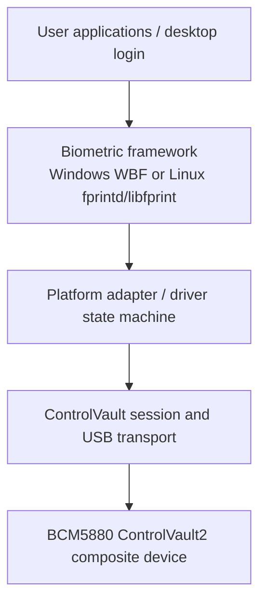
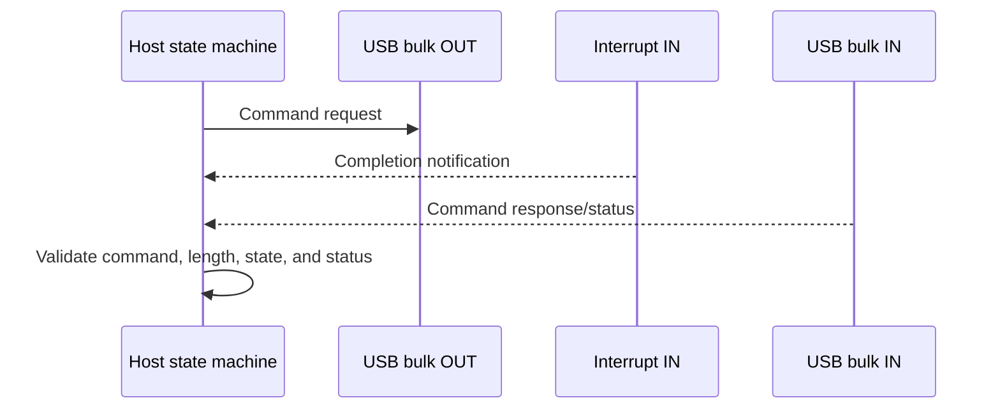
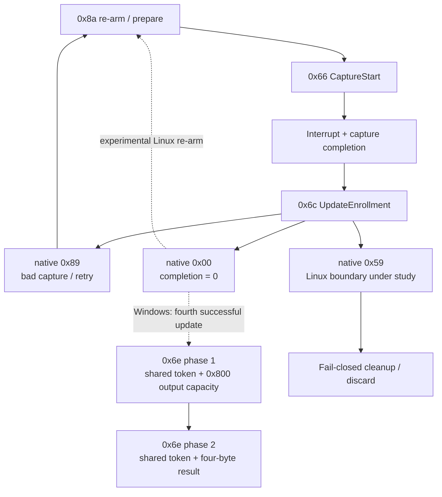

# Architecture and terminology

This document gives new contributors a working mental model of the hardware,
software layers, and enrollment state transitions. It intentionally separates
observed behavior from inferred names and future-driver design.

## Scope

ControlVault2 is a composite security device. On the tested Latitude 7390,
fingerprint, smart-card, NFC, and ControlVault functions belong to one
Broadcom BCM5880-family USB device. A working smart-card or ControlVault
interface does not by itself prove that the biometric interface or its driver
state is healthy.

This repository is an interoperability research project. It does not ship a
vendor binary, a binary patch set, or a production libfprint driver.

## System layers



The reference and research stacks fill those layers differently:

| Layer | Windows A21 reference | Current Linux research |
|---|---|---|
| Framework | Windows Biometric Framework (WBF) and Windows Hello | fprintd and libfprint/TOD harnesses |
| Adapter/state | `BrcmSensorAdapter.dll`, `BrcmEngineAdapter.dll`, and `bipdll.dll` CSS/raw functions | Repository-local probes, interposers, and mock coordinators |
| Device binding | WUDF biometric device with legacy `wbfcvusbdrv` lower filter in the tested VM | Private hash-pinned Broadcom TOD artifact used only for bounded research |
| Transport | Vendor ControlVault session over USB | Observed command/interrupt/bulk behavior; no original transport driver yet |
| Hardware | Passed-through `0a5c:5833` device | Native `0a5c:5833` device |

Names in the Windows column identify components that were observed or
analyzed. They do not imply that their proprietary implementation is included
or licensed by this repository.

## USB identities

| Identity | Meaning in this project |
|---|---|
| `0a5c:5833` | Main tested Latitude 7390 composite identity |
| `0a5c:5834` | Related BCM5880-family identity reported by other owners; status behavior may differ |
| `0a5c:5831` | Recovery/degraded identity seen after an interrupted session; full power removal restored `5833` on the tested unit |

VID:PID alone does not identify every firmware branch. Evidence should also
record laptop model, interface, OS/driver version, and experiment stage.

The tested ControlVault transport on interface 0 exposed:

```text
0x01  bulk OUT
0x81  bulk IN
0x85  interrupt IN
```

Endpoint equality between units is evidence of transport similarity, not
proof of identical firmware semantics.

## Message and completion model

The observed transport uses a request followed by completion signaling and a
bulk response. The project records command identifiers, ordering, lengths,
flags, and status classes while excluding protected biometric payload bytes.



Not every status is a firmware status. For example, the analyzed Linux wrapper
synthesizes `0x8f` when native UpdateEnrollment succeeds but its completion
output remains zero.

## Enrollment operation relationships

The generic enrollment path centers on capture, update, recovery, and commit:



Important qualifications:

- `0x89 → 0x8a → fresh 0x66` is confirmed retry behavior on the tested unit.
- Re-arming accepted-incomplete Linux updates fixes capture continuation, but
  the later native `0x59` remains.
- The dotted Windows edge summarizes a successful function-level trace of
  four zero-status updates; it does not claim that Linux already produces the
  same completion state.
- The two commits are distinct phases, not duplicate invocations with
  identical arguments.
- Protected token and output contents are intentionally neither published nor
  semantically guessed.

See the [current status](current-status.md),
[completion analysis](enrollment-bcm5880-completion-analysis.md), and
[double-commit evidence](evidence/windows-a21-double-commit-static.md).

## Host-template model

Static analysis also exposes a selected BCM5880 host-side path that buffers
three feature records and combines a fourth into a template. Repository mocks
express that shape as:

```text
feature 1 -> buffered slot 0
feature 2 -> buffered slot 1
feature 3 -> buffered slot 2
feature 4 -> create template from all four
          -> TEMPLATE_READY_COMMIT_BLOCKED
```

This is an alternate implementation lead, not proof that the successful
Windows generic `0x6c` runtime used that path. Mock code contains no transport
or live commit callback. See the
[mock coordinator evidence](evidence/bcm5880-coordinator-mock.md).

## Data ownership boundaries

Several buffers are known by size and call position but not by safe public
semantics:

| Object | Established fact | Unresolved question |
|---|---|---|
| Capture/enrollment value | 20-byte value passed between capture/update stages | Exact semantic name and lifetime |
| Update output | 20-byte output can become nonzero | Whether and when it becomes the commit token |
| Update auxiliary output | Four-byte output exists | Meaning in accepted, retry, and completion cases |
| Capture result | Variable-length output with recovered ABI and selector evidence | Whether it is an image, feature record, or another container |
| First commit output | Capacity `0x800`; USB response-size comparison suggests 848 bytes returned | Ownership, format, persistence role, and clearing |
| Second commit result | Four-byte result-only phase | Semantic mapping and rollback behavior |

A matching size or pointer relationship is not enough to assign meaning. A
future driver must establish producer, consumer, ownership, maximum length,
cleanup, and failure behavior for each object.

## Terminology

| Term | Meaning here |
|---|---|
| BCM5880 | Broadcom device family underlying the tested ControlVault2 unit |
| ControlVault2 / CV2 | Dell/Broadcom security-device and command environment under study |
| CV command | Project shorthand for a native ControlVault request identified by a command code |
| CSS | Prefix used by exported Windows vendor functions such as `CSS_FingerprintUpdateEnrollment`; expansion is not asserted |
| WBF | Windows Biometric Framework |
| Windows Hello | Windows enrollment/authentication UI and credential integration using WBF |
| libfprint | Linux fingerprint-device library |
| fprintd | Linux D-Bus service that exposes libfprint functionality |
| TOD | libfprint's vendor-driver mechanism used by the analyzed proprietary Linux artifact |
| Native status | Value returned by the underlying ControlVault operation before host remapping |
| Synthetic status | Status created by a host wrapper rather than returned by firmware, such as `0x8f` in the analyzed path |
| Re-arm | Project term for the observed `0x8a` operation that prepares another capture |
| Accepted-incomplete | Update returned native success while completion remained zero |
| Commit phase 1 | First Windows generic `0x6e` call with byte-output capacity |
| Commit phase 2 | Second Windows generic `0x6e` call with result-only output |
| Protected payload | Biometric, template, token, credential, or cryptographic content excluded from public traces |
| Runtime observed | Recorded on named hardware under the documented controls |
| Statically proven | Instruction/dataflow result tied to an exact artifact hash |
| Cross-session inference | Explanation joining observations that is useful but not direct proof |
| Hypothesis | Candidate explanation awaiting a bounded experiment |

Command names marked “inferred” in the
[command/status reference](controlvault2-command-status-reference.md) are
project terminology, not official Broadcom protocol names.

## Future original-driver boundaries

An original Linux implementation should keep these responsibilities separate:

1. USB enumeration and bounded transport;
2. session ownership, cancellation, timeout, and recovery;
3. command encoding/response validation;
4. capture and retry state;
5. enrollment/template lifecycle;
6. verification result mapping; and
7. libfprint integration and secure data handling.

The first three can be developed and tested before enabling biometric sample
or persistence operations. Enrollment and verification should remain gated
until their data ownership and rollback semantics are proven.
